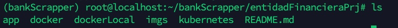
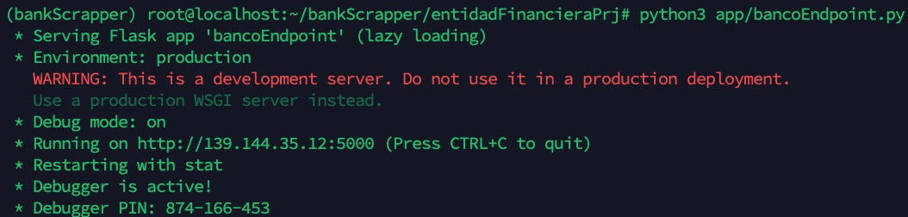
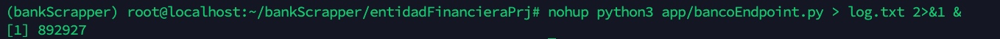
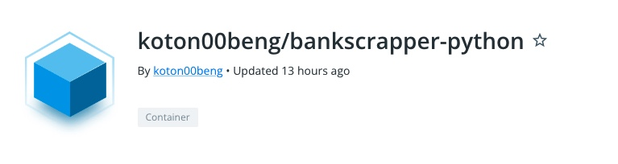

# CRFinancialEntitiesScrapper-
Filter dollar exchange rates in colones for Costa Rican financial entities

The idea of the little project is to scrap data from https://gee.bccr.fi.cr/IndicadoresEconomicos/Cuadros/frmConsultaTCVentanilla.aspx, and show a dropdown with each financial entity in order to get exchange data from each of those.

It show how simple, yet powerfull the use of flask and pandas can be when creating web apps.


# Sofware requirements 

*(Not sure if other software versions different from the ones i list here would break the project, but this is what i have used)
*I used virtualenv in order to run in a more clean space all my packages.

--> Python 3.9.2
--> PIP 20.3.4
--> virtualenv 20.15.1

Project packages:

-->Flask: 2.1.2
-->BeautifulSoup4: 4.11.1 
-->pandas: 1.4.3
-->lxml: 4.9.1
-->html5lib: 1.1


# Steps to get it up and running

1-Once you have setup python, pip and virtualenv just move this folder to the virtualenv folder you created:



2-Check for the following code on line 37:

```

if __name__ == '__main__':
    app.run(host='139.144.35.12', port=5000, debug=True)  # run our Flask app 
```
    
Make sure you change your host to your remote host or localhost depending on where you are hosting this project. You can turn off debuging, change the port, etc.


3-Either run bancoEndpoint.py file on foreground, or background:



or




4-If everything went accordingly you can go to http://yourIPorLocalhost:5000:/dashboard and start using it:


# Running on docker

Some docker/kubernetes files were added in order to deploy the app through docker/kubernetes

dockerLocal folder: Contains a Dockerfile to initiate a basic instance with access to bash with the linode-CLI installed, in case you want to manage a kubernetes cluster through the linode service.

https://www.linode.com/lp/free-credit-short/?promo=sitelin100&promo_value=100&promo_length=60&utm_source=google&utm_medium=cpc&utm_campaign=11178784468_109179199843&utm_term=g_kwd-4269612793_p_linode&utm_content=466889242756&locationid=9070296&device=c_c&gclid=CjwKCAjw2rmWBhB4EiwAiJ0mtUnFlziTtXwXbFEkP4fl_Ozj1mxx6iiYmHFvVMTFCrMi_S8A4NLF-RoCXOsQAvD_BwE

docker: Dockerfile to setup the app so that you can check it and built it yourself, however i have uploaded an image to hub.docker.com and you can pull it if you want:

https://hub.docker.com/r/koton00beng/bankscrapper-python





kubernetes: A simple service.yaml and deployment.yaml that you can use to set a kubernetes cluster with the app.
